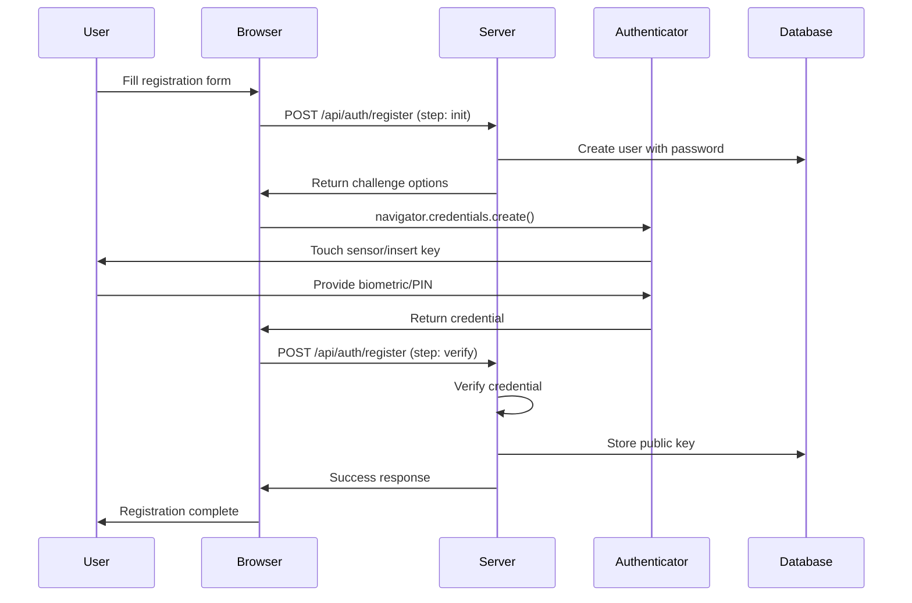
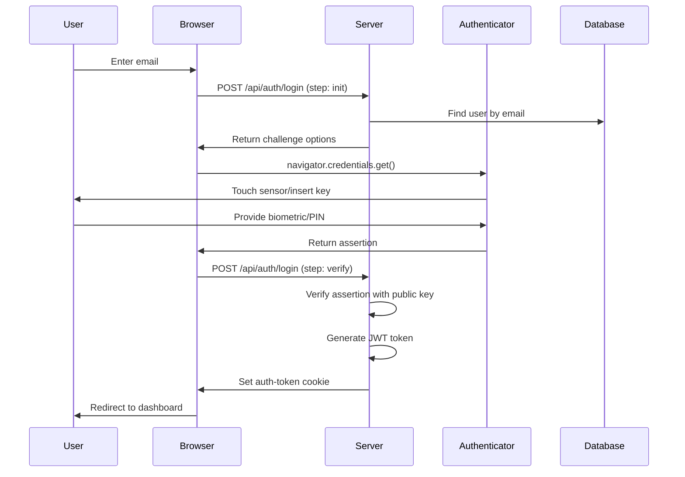
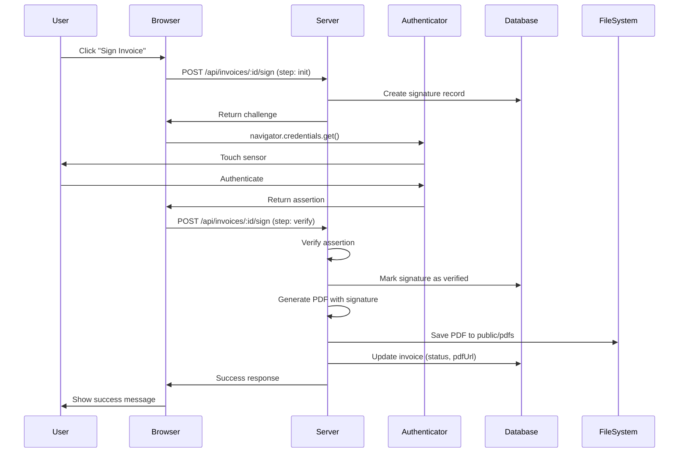

# Invoice Management System - Developer Documentation

**Version:** 1.0.0  
**Last Updated:** October 2025  
**Tech Stack:** Next.js 14, MongoDB, WebAuthn, TypeScript

---

## Table of Contents

1. [Project Overview](#project-overview)
2. [Architecture](#architecture)
3. [Technology Stack](#technology-stack)
4. [Project Structure](#project-structure)
5. [Setup & Installation](#setup--installation)
6. [Database Schema](#database-schema)
7. [API Reference](#api-reference)
8. [Authentication Flow](#authentication-flow)
9. [Component Library](#component-library)
10. [PDF Generation](#pdf-generation)
11. [Security](#security)
12. [Deployment](#deployment)
13. [Testing](#testing)
14. [Troubleshooting](#troubleshooting)
15. [Contributing](#contributing)

---

## Project Overview

### Purpose
A secure, self-hosted invoice management system with WebAuthn-based digital signatures, GST compliance, and PDF generation capabilities.

### Key Features
- ✅ WebAuthn (FIDO2) passwordless authentication
- ✅ GST-compliant invoice generation
- ✅ Digital signature with image upload
- ✅ PDF generation with cryptographic verification
- ✅ Role-based access control (Admin/User)
- ✅ Complete audit logging
- ✅ Offline-first design (no cloud dependencies)

### Target Users
- Small businesses requiring GST-compliant invoicing
- Freelancers and consultants
- Self-hosted desktop application users
- Organizations requiring complete data privacy

---

## Architecture

### High-Level Architecture

```
┌─────────────────────────────────────────────────────┐
│                   Client (Browser)                   │
│  ┌─────────────┐  ┌──────────────┐  ┌────────────┐ │
│  │   React UI  │  │  WebAuthn    │  │   Axios    │ │
│  │  (Next.js)  │  │   Client     │  │ (Fetch API)│ │
│  └─────────────┘  └──────────────┘  └────────────┘ │
└─────────────────────────────────────────────────────┘
                          ▼
┌─────────────────────────────────────────────────────┐
│              Next.js Server (Port 3000)              │
│  ┌──────────────────────────────────────────────┐  │
│  │           Middleware (Auth Check)             │  │
│  └──────────────────────────────────────────────┘  │
│  ┌──────────────┐  ┌──────────────┐              │
│  │  API Routes  │  │  SSR Pages   │              │
│  │              │  │              │              │
│  │ • Auth       │  │ • Dashboard  │              │
│  │ • Invoices   │  │ • Settings   │              │
│  │ • PDF        │  │ • Profile    │              │
│  │ • Logs       │  │              │              │
│  └──────────────┘  └──────────────┘              │
└─────────────────────────────────────────────────────┘
                          ▼
┌─────────────────────────────────────────────────────┐
│           MongoDB (Port 27017)                       │
│  ┌──────────┐  ┌──────────┐  ┌──────────┐         │
│  │  Users   │  │ Invoices │  │   Logs   │         │
│  └──────────┘  └──────────┘  └──────────┘         │
│  ┌──────────┐  ┌──────────┐                        │
│  │Signatures│  │ Settings │                        │
│  └──────────┘  └──────────┘                        │
└─────────────────────────────────────────────────────┘
```

### Data Flow

```
User Action → Middleware → API Route → Database → Response
                    ↓
            JWT Validation
            WebAuthn Verification
            Logging
```

---

## Technology Stack

### Core Technologies

| Technology | Version | Purpose |
|------------|---------|---------|
| Next.js | 14.x | Full-stack React framework |
| React | 18.x | UI library |
| TypeScript | 5.x | Type safety |
| MongoDB | 5.x+ | Database |
| Mongoose | 8.x | ODM for MongoDB |

### Authentication & Security

| Technology | Version | Purpose |
|------------|---------|---------|
| @simplewebauthn/server | 9.x | WebAuthn server implementation |
| @simplewebauthn/browser | 9.x | WebAuthn client implementation |
| jsonwebtoken | 9.x | JWT token generation |
| bcrypt | 5.x | Password hashing |

### UI & Styling

| Technology | Version | Purpose |
|------------|---------|---------|
| Tailwind CSS | 3.x | Utility-first CSS |
| Shadcn UI | Latest | Component library |
| Radix UI | Latest | Headless UI primitives |
| Lucide React | Latest | Icon library |

### PDF & File Processing

| Technology | Version | Purpose |
|------------|---------|---------|
| pdf-lib | 1.17.x | PDF generation |
| fs/promises | Node.js | File system operations |

### Validation & Utilities

| Technology | Version | Purpose |
|------------|---------|---------|
| Zod | 3.x | Schema validation |
| class-variance-authority | Latest | CSS variant management |
| clsx | Latest | Conditional className joining |
| tailwind-merge | Latest | Tailwind class merging |

---

## Project Structure

```
invoice-system/
│
├── app/                              # Next.js App Router
│   ├── (auth)/                       # Authentication routes (no layout)
│   │   ├── login/
│   │   │   └── page.tsx             # Login page
│   │   └── register/
│   │       └── page.tsx             # Registration page
│   │
│   ├── (dashboard)/                  # Protected routes (with layout)
│   │   ├── layout.tsx               # Dashboard navigation layout
│   │   ├── dashboard/
│   │   │   └── page.tsx             # Main dashboard
│   │   ├── invoices/
│   │   │   ├── page.tsx             # Invoice list
│   │   │   ├── new/
│   │   │   │   └── page.tsx         # Create invoice
│   │   │   └── [id]/
│   │   │       ├── page.tsx         # Invoice detail
│   │   │       └── edit/
│   │   │           └── page.tsx     # Edit invoice
│   │   ├── settings/
│   │   │   └── page.tsx             # Company settings
│   │   ├── profile/
│   │   │   └── page.tsx             # User profile
│   │   ├── logs/
│   │   │   └── page.tsx             # System logs (admin)
│   │   └── diagnostics/
│   │       └── page.tsx             # PDF diagnostics
│   │
│   ├── api/                          # API Routes
│   │   ├── auth/
│   │   │   ├── register/route.ts    # User registration
│   │   │   ├── login/route.ts       # User login
│   │   │   └── challenge/route.ts   # WebAuthn challenge
│   │   ├── invoices/
│   │   │   ├── route.ts             # List/Create invoices
│   │   │   └── [id]/
│   │   │       ├── route.ts         # Get/Update/Delete invoice
│   │   │       └── sign/route.ts    # Sign invoice
│   │   ├── pdf/
│   │   │   └── [id]/route.ts        # Download PDF
│   │   ├── logs/
│   │   │   └── route.ts             # System logs
│   │   ├── settings/
│   │   │   └── route.ts             # Company settings
│   │   ├── user/
│   │   │   ├── profile/route.ts     # User profile
│   │   │   └── signature/route.ts   # Signature upload
│   │   ├── test-pdf/route.ts        # PDF generation test
│   │   └── list-pdfs/route.ts       # List PDF files
│   │
│   ├── layout.tsx                    # Root layout
│   ├── page.tsx                      # Landing page
│   ├── not-found.tsx                 # 404 page
│   ├── error.tsx                     # Error page
│   ├── loading.tsx                   # Loading page
│   └── globals.css                   # Global styles
│
├── components/                       # React components
│   ├── ui/                          # Shadcn UI components
│   │   ├── button.tsx
│   │   ├── card.tsx
│   │   ├── dialog.tsx
│   │   ├── input.tsx
│   │   ├── label.tsx
│   │   ├── table.tsx
│   │   ├── alert.tsx
│   │   ├── badge.tsx
│   │   ├── radio-group.tsx
│   │   └── dropdown-menu.tsx
│   │
│   ├── invoice-form.tsx             # Invoice form component
│   ├── invoice-table.tsx            # Invoice table component
│   ├── sign-invoice-dialog.tsx      # Sign dialog component
│   ├── delete-invoice-dialog.tsx    # Delete dialog component
│   ├── signature-upload.tsx         # Signature upload component
│   ├── error-boundary.tsx           # Error boundary component
│   └── toaster.tsx                  # Toast notifications
│
├── lib/                              # Utility libraries
│   ├── db.ts                        # MongoDB connection
│   ├── utils.ts                     # Utility functions (cn)
│   └── webauthn.ts                  # WebAuthn helpers
│
├── models/                           # Mongoose models
│   ├── User.ts                      # User schema
│   ├── Invoice.ts                   # Invoice schema
│   ├── Signature.ts                 # Signature schema
│   ├── Log.ts                       # Log schema
│   └── Setting.ts                   # Settings schema
│
├── utils/                            # Helper functions
│   ├── logger.ts                    # Logging utilities
│   └── pdf.ts                       # PDF generation
│
├── hooks/                            # Custom React hooks
│   └── use-toast.ts                 # Toast hook
│
├── types/                            # TypeScript types
│   └── global.d.ts                  # Global type declarations
│
├── public/                           # Static assets
│   ├── pdfs/                        # Generated PDFs
│   └── signatures/                  # Uploaded signatures
│
├── scripts/                          # Utility scripts
│   ├── start-desktop.js             # Desktop startup script
│   ├── setup.js                     # Setup script
│   └── backup.js                    # Backup script
│
├── middleware.ts                     # Next.js middleware
├── next.config.js                    # Next.js configuration
├── tailwind.config.js                # Tailwind configuration
├── tsconfig.json                     # TypeScript configuration
├── package.json                      # Dependencies
├── .env.local                        # Environment variables
├── .env.example                      # Environment template
├── .gitignore                        # Git ignore rules
└── README.md                         # User documentation
```

---

## Setup & Installation

### Prerequisites

- **Node.js** 18.x or higher
- **MongoDB** 5.0 or higher
- **npm** 9.x or higher
- Modern browser with WebAuthn support

### Step-by-Step Installation

#### 1. Clone Repository

```bash
git clone <repository-url>
cd invoice-system
```

#### 2. Install Dependencies

```bash
npm install
```

#### 3. Setup Environment

```bash
cp .env.example .env.local
```

Edit `.env.local`:

```env
# Database
MONGODB_URI=mongodb://localhost:27017/invoice_system

# Authentication (Generate secure key!)
JWT_SECRET=<generate-random-32-char-string>

# WebAuthn Configuration
RP_NAME=Invoice Management System
RP_ID=localhost
ORIGIN=http://localhost:3000

# Environment
NODE_ENV=development
```

**Generate JWT Secret:**
```bash
node -e "console.log(require('crypto').randomBytes(32).toString('hex'))"
```

#### 4. Create Required Directories

```bash
mkdir -p public/pdfs
mkdir -p public/signatures
mkdir -p data/db
mkdir -p data/backups
```

#### 5. Start MongoDB

```bash
# Local installation
mongod --dbpath ./data/db

# Or with Docker
docker run -d -p 27017:27017 --name mongodb mongo:latest
```

#### 6. Run Development Server

```bash
npm run dev
```

#### 7. Access Application

Open browser: `http://localhost:3000`

### Production Build

```bash
npm run build
npm start
```

---

## Database Schema

### Collections Overview

```
invoice_system
├── users              # User accounts
├── invoices           # Invoice records
├── signatures         # Digital signatures
├── logs               # Audit logs
└── settings           # Company settings
```

### User Schema

```typescript
interface IUser {
  _id: ObjectId;
  name: string;                    // Full name
  email: string;                   // Email (unique)
  passwordHash: string;            // Bcrypt hash
  role: 'admin' | 'user';         // Access level
  webAuthnCredential?: {           // WebAuthn data
    credentialID: string;          // Base64 credential ID
    credentialPublicKey: string;   // Base64 public key
    counter: number;               // Replay attack prevention
    transports?: string[];         // Device transports
  };
  signatureImageUrl?: string;      // Digital signature path
  createdAt: Date;
  updatedAt: Date;
}
```

**Indexes:**
- `email`: unique

**Example:**
```javascript
{
  "_id": ObjectId("..."),
  "name": "John Doe",
  "email": "john@example.com",
  "passwordHash": "$2b$10$...",
  "role": "admin",
  "webAuthnCredential": {
    "credentialID": "AaFdkcw4Su...",
    "credentialPublicKey": "pQECAy...",
    "counter": 5,
    "transports": ["usb", "nfc"]
  },
  "signatureImageUrl": "/signatures/signature-123.png",
  "createdAt": ISODate("2025-01-01T00:00:00Z"),
  "updatedAt": ISODate("2025-01-01T00:00:00Z")
}
```

### Invoice Schema

```typescript
interface IInvoice {
  _id: ObjectId;
  invoiceNumber: string;           // User-defined (unique)
  orderReferenceNumber?: string;   // PO/Order reference
  createdBy: ObjectId;             // User reference
  
  // Client information
  clientName: string;
  clientEmail: string;
  clientAddress: string;
  clientGSTNumber?: string;        // 15-char GSTIN
  
  // Line items
  lineItems: Array<{
    description: string;
    hsnCode: string;               // HSN/SAC code
    quantity: number;
    rate: number;
    total: number;
  }>;
  
  // Tax calculation
  subtotal: number;
  taxType: 'IGST' | 'CGST_SGST';
  igst?: number;                   // 18% inter-state
  cgst?: number;                   // 9% intra-state
  sgst?: number;                   // 9% intra-state
  totalTax: number;
  discount: number;
  grandTotal: number;
  
  // Status and signing
  status: 'draft' | 'signed' | 'cancelled';
  signedBy?: ObjectId;             // User reference
  signedAt?: Date;
  signatureId?: ObjectId;          // Signature reference
  signatureImageUrl?: string;      // Signature image path
  pdfUrl?: string;                 // Generated PDF path
  
  createdAt: Date;
  updatedAt: Date;
}
```

**Indexes:**
- `invoiceNumber`: unique
- `createdBy`: 1
- `status`: 1

**Example:**
```javascript
{
  "_id": ObjectId("..."),
  "invoiceNumber": "INV-2025-001",
  "orderReferenceNumber": "PO-2024-123",
  "createdBy": ObjectId("..."),
  "clientName": "Acme Corp",
  "clientEmail": "client@acme.com",
  "clientAddress": "123 Business St",
  "clientGSTNumber": "22AAAAA0000A1Z5",
  "lineItems": [
    {
      "description": "Web Development",
      "hsnCode": "9954",
      "quantity": 1,
      "rate": 50000,
      "total": 50000
    }
  ],
  "subtotal": 50000,
  "taxType": "CGST_SGST",
  "cgst": 4500,
  "sgst": 4500,
  "totalTax": 9000,
  "discount": 0,
  "grandTotal": 59000,
  "status": "signed",
  "signedBy": ObjectId("..."),
  "signedAt": ISODate("2025-01-15T10:00:00Z"),
  "signatureId": ObjectId("..."),
  "pdfUrl": "/pdfs/INV-2025-001.pdf",
  "createdAt": ISODate("2025-01-15T09:00:00Z"),
  "updatedAt": ISODate("2025-01-15T10:00:00Z")
}
```

### Signature Schema

```typescript
interface ISignature {
  _id: ObjectId;
  userId: ObjectId;                // User reference
  invoiceId: ObjectId;             // Invoice reference
  webAuthnChallengeId: string;     // Challenge used
  verified: boolean;               // Verification status
  verifiedAt?: Date;               // Verification timestamp
  signatureText: string;           // Display text
  timestamp: Date;                 // Signing timestamp
  createdAt: Date;
}
```

**Indexes:**
- `invoiceId`: 1
- `userId`: 1

### Log Schema

```typescript
interface ILog {
  _id: ObjectId;
  userId?: ObjectId;               // User reference
  action: string;                  // Action type
  entity: string;                  // Entity type
  entityId?: string;               // Entity ID
  description: string;             // Human-readable description
  ipAddress?: string;              // Client IP
  createdAt: Date;
}
```

**Indexes:**
- `action`: 1
- `userId`: 1
- `createdAt`: -1 (descending)

**Common Actions:**
- LOGIN_SUCCESS
- LOGIN_FAILED
- INVOICE_CREATED
- INVOICE_SIGNED
- PDF_GENERATED

### Setting Schema

```typescript
interface ISetting {
  _id: ObjectId;
  companyName: string;
  companyAddress: string;
  companyEmail: string;
  companyPhone: string;
  logoUrl?: string;
  invoicePrefix: string;           // e.g., "INV"
  taxRate: number;                 // Default tax rate
  termsText: string;               // Terms & conditions
  createdAt: Date;
  updatedAt: Date;
}
```

**Note:** Only one document should exist (singleton pattern)

---

## API Reference

### Authentication APIs

#### POST `/api/auth/register`

Register a new user with WebAuthn.

**Step 1: Initialize**

```typescript
// Request
POST /api/auth/register
Content-Type: application/json

{
  "step": "init",
  "name": "John Doe",
  "email": "john@example.com",
  "password": "SecurePass123!",
  "role": "user"  // or "admin"
}

// Response (200)
{
  "userId": "507f1f77bcf86cd799439011",
  "options": {
    "challenge": "base64_challenge",
    "rp": { "name": "Invoice System", "id": "localhost" },
    "user": {
      "id": "base64_user_id",
      "name": "john@example.com",
      "displayName": "John Doe"
    },
    "pubKeyCredParams": [...],
    "timeout": 60000,
    "attestation": "none"
  }
}
```

**Step 2: Verify**

```typescript
// Request
POST /api/auth/register
Content-Type: application/json

{
  "step": "verify",
  "userId": "507f1f77bcf86cd799439011",
  "credential": {
    // WebAuthn credential response
  }
}

// Response (200)
{
  "success": true,
  "user": {
    "id": "507f1f77bcf86cd799439011",
    "name": "John Doe",
    "email": "john@example.com"
  }
}
```

**Errors:**
- `400`: Invalid input or user already exists
- `401`: Verification failed

---

#### POST `/api/auth/login`

Login with WebAuthn.

**Step 1: Initialize**

```typescript
// Request
POST /api/auth/login
Content-Type: application/json

{
  "step": "init",
  "email": "john@example.com"
}

// Response (200)
{
  "userId": "507f1f77bcf86cd799439011",
  "options": {
    "challenge": "base64_challenge",
    "timeout": 60000,
    "rpId": "localhost"
  },
  "credentialId": "base64_credential_id"
}
```

**Step 2: Verify**

```typescript
// Request
POST /api/auth/login
Content-Type: application/json

{
  "step": "verify",
  "userId": "507f1f77bcf86cd799439011",
  "credential": {
    // WebAuthn authentication response
  }
}

// Response (200)
// Sets auth-token cookie
{
  "success": true,
  "user": {
    "id": "507f1f77bcf86cd799439011",
    "name": "John Doe",
    "email": "john@example.com",
    "role": "admin"
  }
}
```

**Errors:**
- `401`: Invalid credentials
- `400`: Invalid input

---

### Invoice APIs

#### GET `/api/invoices`

List all invoices for the authenticated user.

```typescript
// Request
GET /api/invoices?status=draft&page=1&limit=20
Cookie: auth-token=<jwt>

// Response (200)
{
  "invoices": [
    {
      "_id": "...",
      "invoiceNumber": "INV-2025-001",
      "clientName": "Acme Corp",
      "grandTotal": 59000,
      "status": "signed",
      "createdAt": "2025-01-15T09:00:00Z",
      "createdBy": { "name": "John Doe", "email": "john@example.com" }
    }
  ]
}
```

**Query Parameters:**
- `status`: Filter by status (draft, signed, cancelled)
- `page`: Page number (default: 1)
- `limit`: Items per page (default: 20)

---

#### POST `/api/invoices`

Create a new invoice.

```typescript
// Request
POST /api/invoices
Content-Type: application/json
Cookie: auth-token=<jwt>

{
  "invoiceNumber": "INV-2025-001",
  "orderReferenceNumber": "PO-123",
  "clientName": "Acme Corp",
  "clientEmail": "client@acme.com",
  "clientAddress": "123 Business St",
  "clientGSTNumber": "22AAAAA0000A1Z5",
  "lineItems": [
    {
      "description": "Web Development",
      "hsnCode": "9954",
      "quantity": 1,
      "rate": 50000,
      "total": 50000
    }
  ],
  "taxType": "CGST_SGST",
  "discount": 0
}

// Response (201)
{
  "invoice": {
    "_id": "...",
    "invoiceNumber": "INV-2025-001",
    // ... full invoice object
  }
}
```

**Errors:**
- `400`: Invalid input or invoice number exists
- `401`: Unauthorized

---

#### GET `/api/invoices/[id]`

Get invoice details.

```typescript
// Request
GET /api/invoices/507f1f77bcf86cd799439011
Cookie: auth-token=<jwt>

// Response (200)
{
  "invoice": {
    // ... full invoice object with populated references
  }
}
```

---

#### PUT `/api/invoices/[id]`

Update an invoice (only drafts).

```typescript
// Request
PUT /api/invoices/507f1f77bcf86cd799439011
Content-Type: application/json
Cookie: auth-token=<jwt>

{
  "clientName": "Updated Name",
  "lineItems": [...]
  // ... fields to update
}

// Response (200)
{
  "invoice": {
    // ... updated invoice object
  }
}
```

**Errors:**
- `400`: Cannot update signed invoices
- `403`: Not authorized
- `404`: Invoice not found

---

#### DELETE `/api/invoices/[id]`

Delete an invoice (admin only).

```typescript
// Request
DELETE /api/invoices/507f1f77bcf86cd799439011
Cookie: auth-token=<jwt>

// Response (200)
{
  "success": true
}
```

**Errors:**
- `403`: Admin access required
- `404`: Invoice not found

---

#### POST `/api/invoices/[id]/sign`

Sign an invoice with WebAuthn.

**Step 1: Initialize**

```typescript
// Request
POST /api/invoices/507f1f77bcf86cd799439011/sign
Content-Type: application/json
Cookie: auth-token=<jwt>

{
  "step": "init"
}

// Response (200)
{
  "success": true,
  "signatureId": "...",
  "options": {
    "challenge": "...",
    // WebAuthn options
  },
  "credentialId": "..."
}
```

**Step 2: Verify and Complete**

```typescript
// Request
POST /api/invoices/507f1f77bcf86cd799439011/sign
Content-Type: application/json
Cookie: auth-token=<jwt>

{
  "step": "verify",
  "signatureId": "...",
  "credential": {
    // WebAuthn response
  }
}

// Response (200)
{
  "success": true,
  "message": "Invoice signed successfully",
  "invoice": {
    "id": "...",
    "invoiceNumber": "INV-2025-001",
    "status": "signed",
    "pdfUrl": "/pdfs/INV-2025-001.pdf",
    "signedAt": "...",
    "signedBy": {...}
  }
}
```

---

### PDF APIs

#### GET `/api/pdf/[id]`

Download invoice PDF.

```typescript
// Request
GET /api/pdf/507f1f77bcf86cd799439011
Cookie: auth-token=<jwt>

// Response (200)
Content-Type: application/pdf
Content-Disposition: attachment; filename="INV-2025-001.pdf"

<PDF binary data>
```

**Errors:**
- `400`: PDF not available (invoice not signed)
- `404`: PDF file not found
- `403`: Not authorized

---

### Settings APIs

#### GET `/api/settings`

Get company settings.

```typescript
// Request
GET /api/settings
Cookie: auth-token=<jwt>

// Response (200)
{
  "settings": {
    "companyName": "Your Company",
    "companyAddress": "...",
    "companyEmail": "...",
    "companyPhone": "...",
    "invoicePrefix": "INV",
    "taxRate": 0,
    "termsText": "..."
  }
}
```

---

#### PUT `/api/settings`

Update company settings (admin only).

```typescript
// Request
PUT /api/settings
Content-Type: application/json
Cookie: auth-token=<jwt>

{
  "companyName": "Updated Company Name",
  "companyAddress": "...",
  // ... fields to update
}

// Response (200)
{
  "settings": {
    // ... updated settings
  }
}
```

**Errors:**
- `403`: Admin access required

---

### User APIs

#### GET `/api/user/profile`

Get current user profile.

```typescript
// Request
GET /api/user/profile
Cookie: auth-token=<jwt>

// Response (200)
{
  "user": {
    "id": "...",
    "name": "John Doe",
    "email": "john@example.com",
    "role": "admin",
    "hasWebAuthn": true,
    "createdAt": "...",
    "updatedAt": "..."
  }
}
```

---

#### PUT `/api/user/profile`

Update user profile.

```typescript
// Request
PUT /api/user/profile
Content-Type: application/json
Cookie: auth-token=<jwt>

{
  "name": "Updated Name",
  "email": "newemail@example.com",
  "currentPassword": "old_password",  // Required for password change
  "newPassword": "new_password"       // Optional
}

// Response (200)
{
  "message": "Profile updated successfully",
  "user": {
    "id": "...",
    "name": "Updated Name",
    "email": "newemail@example.com",
    "role": "admin"
  }
}
```

---

#### POST `/api/user/signature`

Upload digital signature image.

```typescript
// Request
POST /api/user/signature
Content-Type: multipart/form-data
Cookie: auth-token=<jwt>

FormData:
  signature: <File> (image/png, image/jpeg, max 2MB)

// Response (200)
{
  "success": true,
  "signatureUrl": "/signatures/signature-123.png"
}
```

**Errors:**
- `400`: Invalid file type or size
- `401`: Unauthorized

---

#### GET `/api/user/signature`

Get current signature URL.

```typescript
// Request
GET /api/user/signature
Cookie: auth-token=<jwt>

// Response (200)
{
  "signatureUrl": "/signatures/signature-123.png"
}
```

---

### Logs APIs

#### GET `/api/logs`

Get system logs (admin only).

```typescript
// Request
GET /api/logs?page=1&limit=50&action=LOGIN_SUCCESS&userId=...
Cookie: auth-token=<jwt>

// Response (200)
{
  "logs": [
    {
      "_id": "...",
      "userId": { "name": "John Doe", "email": "..." },
      "action": "LOGIN_SUCCESS",
      "entity": "user",
      "entityId": "...",
      "description": "User logged in: john@example.com",
      "ipAddress": "192.168.1.1",
      "createdAt": "2025-01-15T10:00:00Z"
    }
  ],
  "pagination": {
    "page": 1,
    "limit": 50,
    "total": 150,
    "pages": 3
  }
}
```

**Query Parameters:**
- `page`: Page number
- `limit`: Items per page
- `action`: Filter by action type
- `userId`: Filter by user ID

**Errors:**
- `403`: Admin access required

---

## Authentication Flow

### WebAuthn Registration Flow



### WebAuthn Login Flow



### Invoice Signing Flow



---

## Component Library

### Core Components

#### Button Component

**Location:** `components/ui/button.tsx`

```typescript
import { Button } from '@/components/ui/button';

// Variants
<Button variant="default">Default</Button>
<Button variant="destructive">Delete</Button>
<Button variant="outline">Cancel</Button>
<Button variant="secondary">Secondary</Button>
<Button variant="ghost">Ghost</Button>
<Button variant="link">Link</Button>

// Sizes
<Button size="default">Default</Button>
<Button size="sm">Small</Button>
<Button size="lg">Large</Button>
<Button size="icon"><Icon /></Button>

// States
<Button disabled>Disabled</Button>
<Button loading>Loading...</Button>
```

#### Card Component

**Location:** `components/ui/card.tsx`

```typescript
import { Card, CardContent, CardDescription, CardFooter, CardHeader, CardTitle } from '@/components/ui/card';

<Card>
  <CardHeader>
    <CardTitle>Card Title</CardTitle>
    <CardDescription>Card description</CardDescription>
  </CardHeader>
  <CardContent>
    Content goes here
  </CardContent>
  <CardFooter>
    Footer content
  </CardFooter>
</Card>
```

#### Dialog Component

**Location:** `components/ui/dialog.tsx`

```typescript
import { Dialog, DialogContent, DialogDescription, DialogFooter, DialogHeader, DialogTitle } from '@/components/ui/dialog';

const [open, setOpen] = useState(false);

<Dialog open={open} onOpenChange={setOpen}>
  <DialogContent>
    <DialogHeader>
      <DialogTitle>Dialog Title</DialogTitle>
      <DialogDescription>Description</DialogDescription>
    </DialogHeader>
    <div>Dialog content</div>
    <DialogFooter>
      <Button onClick={() => setOpen(false)}>Close</Button>
    </DialogFooter>
  </DialogContent>
</Dialog>
```

### Business Components

#### InvoiceForm Component

**Location:** `components/invoice-form.tsx`

```typescript
import InvoiceForm, { InvoiceFormData } from '@/components/invoice-form';

const handleSubmit = async (data: InvoiceFormData) => {
  // Handle form submission
};

<InvoiceForm
  initialData={existingInvoice}  // Optional
  onSubmit={handleSubmit}
  onCancel={() => router.back()}
  submitLabel="Create Invoice"
  isEdit={false}
/>
```

**Props:**
- `initialData?`: Partial invoice data for editing
- `onSubmit`: Async function called on form submission
- `onCancel?`: Function called when cancel is clicked
- `submitLabel?`: Custom submit button text
- `isEdit?`: Whether in edit mode

#### InvoiceTable Component

**Location:** `components/invoice-table.tsx`

```typescript
import InvoiceTableWithActions from '@/components/invoice-table';

<InvoiceTableWithActions
  invoices={invoiceList}
  loading={isLoading}
  userRole="admin"
  onRefresh={fetchInvoices}
/>
```

**Props:**
- `invoices`: Array of invoice objects
- `loading?`: Loading state
- `userRole?`: Current user role
- `onRefresh?`: Callback to refresh data

#### SignInvoiceDialog Component

**Location:** `components/sign-invoice-dialog.tsx`

```typescript
import SignInvoiceDialog from '@/components/sign-invoice-dialog';

<SignInvoiceDialog
  open={dialogOpen}
  onOpenChange={setDialogOpen}
  invoiceId="507f..."
  invoiceNumber="INV-2025-001"
  onSuccess={() => router.refresh()}
  onError={(error) => console.error(error)}
/>
```

#### SignatureUpload Component

**Location:** `components/signature-upload.tsx`

```typescript
import SignatureUpload from '@/components/signature-upload';

<SignatureUpload
  currentSignatureUrl="/signatures/sig.png"
  onUploadSuccess={(url) => console.log('Uploaded:', url)}
/>
```

---

## PDF Generation

### Overview

PDFs are generated using `pdf-lib` library with custom layouts for GST-compliant invoices.

### PDF Generation Process

```typescript
// Location: utils/pdf.ts

1. Create PDF document
2. Embed fonts (Helvetica, Helvetica-Bold)
3. Add company header
4. Add invoice details (number, date, order ref)
5. Add client information (with GST number)
6. Create line items table with HSN codes
7. Calculate and display tax breakdown (IGST or CGST+SGST)
8. Add totals section
9. Embed signature image (if available)
10. Add terms & conditions
11. Save as Buffer
12. Write to public/pdfs/
```

### PDF Layout

```
┌─────────────────────────────────────────────────┐
│ Company Name                                     │
│ Address, Email, Phone                            │
│                                                  │
│ TAX INVOICE                                      │
│ Invoice No: INV-2025-001    Date: 15/01/2025   │
│ Order Ref: PO-123                                │
│                                                  │
│ Bill To:                                         │
│ Client Name                                      │
│ client@example.com                               │
│ Client Address                                   │
│ GSTIN: 22AAAAA0000A1Z5                          │
│                                                  │
│ ┌─────────────────────────────────────────────┐ │
│ │ Description │ HSN │ Qty │ Rate │ Amount    │ │
│ ├─────────────────────────────────────────────┤ │
│ │ Web Dev     │9954 │  1  │50000│  50000    │ │
│ └─────────────────────────────────────────────┘ │
│                                                  │
│                            Subtotal: ₹50,000.00 │
│                            CGST 9%:   ₹4,500.00 │
│                            SGST 9%:   ₹4,500.00 │
│                            Total Tax: ₹9,000.00 │
│                            Discount:      ₹0.00 │
│                            Grand Total: ₹59,000 │
│                                                  │
│ Authorized Signatory                             │
│ [Digital Signature Image]                        │
│ John Doe                                         │
│ Signed: 15/01/2025 10:00 AM                     │
│ ✓ Verified via WebAuthn (FIDO2)                │
│                                                  │
│ Terms & Conditions:                              │
│ Payment due within 30 days...                    │
└─────────────────────────────────────────────────┘
```

### Customization

**Add Logo to PDF:**

```typescript
// In utils/pdf.ts
const logoPath = path.join(process.cwd(), 'public', settings.logoUrl);
if (fs.existsSync(logoPath)) {
  const logoBytes = fs.readFileSync(logoPath);
  const logoImage = await pdfDoc.embedPng(logoBytes);
  const logoDims = logoImage.scale(0.2);
  
  page.drawImage(logoImage, {
    x: 450,
    y: height - 100,
    width: logoDims.width,
    height: logoDims.height,
  });
}
```

**Change Colors:**

```typescript
// Use rgb(r, g, b) values between 0 and 1
page.drawText('TAX INVOICE', {
  color: rgb(0.2, 0.2, 0.8), // Blue
});
```

---

## Security

### Security Features

#### 1. WebAuthn (FIDO2)
- **Phishing-resistant**: Challenge-response mechanism
- **No shared secrets**: Private key never leaves device
- **Replay protection**: Counter-based verification
- **MitM protection**: Origin validation

#### 2. JWT Tokens
- **HTTPOnly cookies**: Not accessible via JavaScript
- **Secure flag**: HTTPS-only in production
- **7-day expiration**: Automatic logout
- **Signed tokens**: Prevents tampering

#### 3. Password Security
- **Bcrypt hashing**: 10 rounds (2^10 iterations)
- **Minimum 8 characters**: Enforced client and server
- **Salt per password**: Unique hash for each

#### 4. Middleware Protection
- **Route-based auth**: Protects all dashboard routes
- **API authentication**: Token validation on all API calls
- **Role-based access**: Admin-only routes enforced
- **Challenge expiration**: 60-second timeout

#### 5. Input Validation
- **Zod schemas**: Type-safe validation
- **Server-side validation**: Never trust client
- **SQL injection**: N/A (NoSQL database)
- **XSS protection**: React escapes by default

#### 6. Audit Logging
- **All actions logged**: CREATE, READ, UPDATE, DELETE
- **IP address tracking**: Client identification
- **Timestamp tracking**: When action occurred
- **User association**: Who performed action

### Security Best Practices

#### Environment Variables

```bash
# Never commit .env.local to Git
# Generate strong JWT secret
JWT_SECRET=$(openssl rand -hex 32)

# Use different secrets per environment
# Development: weak_secret_ok
# Production: 64+ character random string
```

#### Cookie Configuration

```typescript
// Production settings
response.cookies.set('auth-token', token, {
  httpOnly: true,       // No JavaScript access
  secure: true,         // HTTPS only
  sameSite: 'strict',   // CSRF protection
  maxAge: 7 * 24 * 60 * 60,  // 7 days
  path: '/',
});
```

#### Rate Limiting

```typescript
// Add to middleware.ts
const rateLimitMap = new Map();

function rateLimit(ip: string) {
  const now = Date.now();
  const record = rateLimitMap.get(ip);
  
  if (!record || now > record.resetTime) {
    rateLimitMap.set(ip, { count: 1, resetTime: now + 60000 });
    return true;
  }
  
  if (record.count >= 100) return false;
  record.count++;
  return true;
}
```

#### File Upload Security

```typescript
// Validate file types
const allowedTypes = ['image/png', 'image/jpeg', 'image/jpg'];
if (!allowedTypes.includes(file.type)) {
  return error('Invalid file type');
}

// Limit file size
if (file.size > 2 * 1024 * 1024) {  // 2MB
  return error('File too large');
}

// Sanitize filename
const safeFilename = filename.replace(/[^a-zA-Z0-9.-]/g, '_');
```

### Security Checklist

- [ ] JWT_SECRET is strong (32+ characters)
- [ ] HTTPS enabled in production
- [ ] Cookie secure flag set to true
- [ ] MongoDB authentication enabled
- [ ] File upload size limits enforced
- [ ] Input validation on all endpoints
- [ ] Rate limiting implemented
- [ ] Audit logging enabled
- [ ] Error messages don't leak sensitive info
- [ ] Dependencies regularly updated
- [ ] Backup strategy in place

---

## Deployment

### Self-Hosted Deployment

#### System Requirements

**Minimum:**
- CPU: 2 cores
- RAM: 4GB
- Storage: 10GB (+ space for PDFs)
- OS: Ubuntu 20.04+ / Windows 10+ / macOS 10.15+

**Recommended:**
- CPU: 4 cores
- RAM: 8GB
- Storage: 50GB SSD
- OS: Ubuntu 22.04 LTS

#### Production Setup

**1. Install Node.js**

```bash
# Ubuntu/Debian
curl -fsSL https://deb.nodesource.com/setup_18.x | sudo -E bash -
sudo apt-get install -y nodejs

# Verify
node --version  # Should be 18.x or higher
npm --version   # Should be 9.x or higher
```

**2. Install MongoDB**

```bash
# Ubuntu/Debian
wget -qO - https://www.mongodb.org/static/pgp/server-6.0.asc | sudo apt-key add -
echo "deb [ arch=amd64,arm64 ] https://repo.mongodb.org/apt/ubuntu jammy/mongodb-org/6.0 multiverse" | sudo tee /etc/apt/sources.list.d/mongodb-org-6.0.list
sudo apt-get update
sudo apt-get install -y mongodb-org

# Start MongoDB
sudo systemctl start mongod
sudo systemctl enable mongod
```

**3. Clone and Setup Application**

```bash
# Clone repository
git clone <repository-url>
cd invoice-system

# Install dependencies
npm ci --production

# Setup environment
cp .env.example .env.local
nano .env.local  # Edit configuration

# Generate JWT secret
node -e "console.log(require('crypto').randomBytes(32).toString('hex'))"

# Create directories
mkdir -p public/pdfs public/signatures data/backups

# Build application
npm run build
```

**4. Environment Configuration**

```env
# .env.local (Production)
MONGODB_URI=mongodb://localhost:27017/invoice_system
JWT_SECRET=<64-character-hex-string>
RP_NAME=Invoice Management System
RP_ID=yourdomain.com
ORIGIN=https://yourdomain.com
NODE_ENV=production
PORT=3000
```

**5. Run as Service (Linux)**

```bash
# Create systemd service
sudo nano /etc/systemd/system/invoice-system.service
```

```ini
[Unit]
Description=Invoice Management System
After=network.target mongod.service

[Service]
Type=simple
User=www-data
WorkingDirectory=/opt/invoice-system
Environment="NODE_ENV=production"
ExecStart=/usr/bin/npm start
Restart=always
RestartSec=10

[Install]
WantedBy=multi-user.target
```

```bash
# Enable and start
sudo systemctl enable invoice-system
sudo systemctl start invoice-system
sudo systemctl status invoice-system
```

**6. Nginx Reverse Proxy**

```nginx
# /etc/nginx/sites-available/invoice-system
server {
    listen 80;
    server_name yourdomain.com;
    
    location / {
        proxy_pass http://localhost:3000;
        proxy_http_version 1.1;
        proxy_set_header Upgrade $http_upgrade;
        proxy_set_header Connection 'upgrade';
        proxy_set_header Host $host;
        proxy_set_header X-Real-IP $remote_addr;
        proxy_set_header X-Forwarded-For $proxy_add_x_forwarded_for;
        proxy_set_header X-Forwarded-Proto $scheme;
        proxy_cache_bypass $http_upgrade;
    }
}
```

```bash
# Enable site
sudo ln -s /etc/nginx/sites-available/invoice-system /etc/nginx/sites-enabled/
sudo nginx -t
sudo systemctl restart nginx
```

**7. SSL Certificate (Let's Encrypt)**

```bash
sudo apt install certbot python3-certbot-nginx
sudo certbot --nginx -d yourdomain.com
```

#### Windows Deployment

**Using PM2:**

```powershell
# Install PM2 globally
npm install -g pm2

# Start application
pm2 start npm --name "invoice-system" -- start

# Save process list
pm2 save

# Setup startup
pm2 startup

# Generate startup script (copy and run the command it outputs)
```

**As Windows Service (NSSM):**

```powershell
# Download NSSM from nssm.cc
# Install service
nssm install InvoiceSystem "C:\Program Files\nodejs\node.exe" "C:\invoice-system\node_modules\next\dist\bin\next" start
nssm set InvoiceSystem AppDirectory "C:\invoice-system"
nssm start InvoiceSystem
```

### Docker Deployment

**Dockerfile:**

```dockerfile
FROM node:18-alpine

WORKDIR /app

# Copy package files
COPY package*.json ./

# Install dependencies
RUN npm ci --production

# Copy application
COPY . .

# Build application
RUN npm run build

# Expose port
EXPOSE 3000

# Start application
CMD ["npm", "start"]
```

**docker-compose.yml:**

```yaml
version: '3.8'

services:
  mongodb:
    image: mongo:6
    volumes:
      - mongodb_data:/data/db
    ports:
      - "27017:27017"
    restart: unless-stopped

  invoice-system:
    build: .
    ports:
      - "3000:3000"
    environment:
      - MONGODB_URI=mongodb://mongodb:27017/invoice_system
      - JWT_SECRET=${JWT_SECRET}
      - RP_NAME=Invoice Management System
      - RP_ID=localhost
      - ORIGIN=http://localhost:3000
      - NODE_ENV=production
    volumes:
      - ./public/pdfs:/app/public/pdfs
      - ./public/signatures:/app/public/signatures
    depends_on:
      - mongodb
    restart: unless-stopped

volumes:
  mongodb_data:
```

**Usage:**

```bash
# Start services
docker-compose up -d

# View logs
docker-compose logs -f invoice-system

# Stop services
docker-compose down
```

---

## Testing

### Manual Testing Checklist

#### Authentication
- [ ] Register new user with WebAuthn
- [ ] Register fails with existing email
- [ ] Login with WebAuthn
- [ ] Login fails with wrong email
- [ ] WebAuthn timeout after 60 seconds
- [ ] Session persists after page refresh
- [ ] Logout clears session

#### Invoices
- [ ] Create invoice with all fields
- [ ] Create invoice with duplicate number (should fail)
- [ ] Edit draft invoice
- [ ] Cannot edit signed invoice
- [ ] Delete invoice (admin only)
- [ ] List invoices with filters
- [ ] View invoice details
- [ ] Tax calculation (IGST)
- [ ] Tax calculation (CGST+SGST)

#### Signing
- [ ] Sign draft invoice
- [ ] Cannot sign already signed invoice
- [ ] PDF generates successfully
- [ ] PDF contains signature image
- [ ] PDF download works
- [ ] WebAuthn verification timeout

#### Settings
- [ ] Update company settings (admin)
- [ ] Non-admin cannot access settings
- [ ] Settings persist after update

#### Profile
- [ ] Update user name
- [ ] Update email
- [ ] Change password
- [ ] Upload signature image
- [ ] Signature appears in PDF

#### Logs
- [ ] View logs (admin only)
- [ ] Filter logs by action
- [ ] Filter logs by user
- [ ] Pagination works

### Automated Testing

**Unit Tests (Example):**

```typescript
// __tests__/utils/pdf.test.ts
import { generateInvoicePDF } from '@/utils/pdf';

describe('PDF Generation', () => {
  it('should generate PDF buffer', async () => {
    const mockInvoice = {
      invoiceNumber: 'TEST-001',
      // ... mock data
    };
    
    const buffer = await generateInvoicePDF(
      mockInvoice,
      mockSettings,
      'Test User',
      new Date()
    );
    
    expect(buffer).toBeInstanceOf(Buffer);
    expect(buffer.length).toBeGreaterThan(0);
  });
});
```

**Integration Tests:**

```typescript
// __tests__/api/invoices.test.ts
import { POST } from '@/app/api/invoices/route';

describe('POST /api/invoices', () => {
  it('should create invoice', async () => {
    const req = new NextRequest('http://localhost:3000/api/invoices', {
      method: 'POST',
      body: JSON.stringify(mockInvoiceData),
      headers: { cookie: 'auth-token=...' }
    });
    
    const res = await POST(req);
    const data = await res.json();
    
    expect(res.status).toBe(201);
    expect(data.invoice).toBeDefined();
  });
});
```

---

## Troubleshooting

### Common Issues

#### Issue: MongoDB Connection Failed

**Symptoms:**
```
MongooseError: connect ECONNREFUSED 127.0.0.1:27017
```

**Solutions:**
```bash
# Check if MongoDB is running
sudo systemctl status mongod

# Start MongoDB
sudo systemctl start mongod

# Check MongoDB logs
sudo tail -f /var/log/mongodb/mongod.log

# Test connection
mongosh --eval "db.runCommand({ ping: 1 })"
```

---

#### Issue: WebAuthn Not Working

**Symptoms:**
- "WebAuthn not supported" error
- Authentication fails silently

**Solutions:**
1. **Check HTTPS:** WebAuthn requires HTTPS (except localhost)
2. **Check browser support:** Use Chrome 67+, Firefox 60+, Safari 13+
3. **Check RP_ID:** Must match domain
4. **Check origin:** Must match ORIGIN in .env

```typescript
// Debug WebAuthn
console.log('WebAuthn supported:', window.PublicKeyCredential !== undefined);
console.log('Platform authenticator:', await PublicKeyCredential.isUserVerifyingPlatformAuthenticatorAvailable());
```

---

#### Issue: PDF Generation Fails

**Symptoms:**
```
Error: Failed to generate PDF: ENOENT: no such file or directory
```

**Solutions:**
```bash
# Create PDF directory
mkdir -p public/pdfs
chmod 755 public/pdfs

# Check disk space
df -h

# Check write permissions
touch public/pdfs/test.txt && rm public/pdfs/test.txt

# Check Node.js file system access
node -e "const fs = require('fs'); fs.writeFileSync('public/pdfs/test.pdf', 'test');"
```

---

#### Issue: PDFs Not Downloading

**Symptoms:**
- "Failed to download PDF" error
- 404 on PDF URL

**Solutions:**
1. **Check file exists:**
```bash
ls -la public/pdfs/
```

2. **Check PDF URL in database:**
```javascript
db.invoices.find({ pdfUrl: { $exists: true } })
```

3. **Check middleware not blocking:**
```typescript
// In middleware.ts
if (pathname.startsWith('/pdfs/')) {
  return NextResponse.next(); // Allow static files
}
```

4. **Try direct URL:**
```
http://localhost:3000/pdfs/INV-2025-001.pdf
```

---

#### Issue: "use client" Error

**Symptoms:**
```
Error: Event handlers cannot be passed to Client Component props
```

**Solution:**
Add `'use client'` directive at the top of the file:

```typescript
'use client';

import { useState } from 'react';
// ... rest of imports

export default function MyComponent() {
  // Component code
}
```

---

#### Issue: Cookie Not Being Set

**Symptoms:**
- Login succeeds but dashboard shows no data
- API calls return 401

**Solutions:**
```typescript
// Check cookie settings
response.cookies.set('auth-token', token, {
  httpOnly: true,
  secure: false,  // false in development!
  sameSite: 'lax', // not 'strict'
  path: '/',      // must be '/'
  maxAge: 7 * 24 * 60 * 60
});

// Check in browser
// DevTools > Application > Cookies
// Verify auth-token exists with correct settings
```

---

### Debug Mode

Enable verbose logging:

```typescript
// Add to .env.local
DEBUG=true
LOG_LEVEL=verbose

// In your code
if (process.env.DEBUG === 'true') {
  console.log('Debug:', data);
}
```

---

## Contributing

### Development Workflow

1. **Fork repository**
2. **Create feature branch:** `git checkout -b feature/new-feature`
3. **Make changes**
4. **Test changes:** Manual + automated tests
5. **Commit:** `git commit -m "Add new feature"`
6. **Push:** `git push origin feature/new-feature`
7. **Create Pull Request**

### Code Style

**TypeScript:**
- Use TypeScript for all new code
- Define interfaces for data structures
- Use strict mode
- Avoid `any` type

**React:**
- Functional components only
- Use hooks (useState, useEffect, etc.)
- Add `'use client'` for interactive components
- Keep components small and focused

**Naming Conventions:**
- Files: kebab-case (`invoice-form.tsx`)
- Components: PascalCase (`InvoiceForm`)
- Functions: camelCase (`generatePDF`)
- Constants: UPPER_SNAKE_CASE (`JWT_SECRET`)

**Comments:**
```typescript
/**
 * Generate invoice PDF with GST compliance
 * @param invoice - Invoice data
 * @param settings - Company settings
 * @returns PDF buffer
 */
export async function generateInvoicePDF(...) {
  // Implementation
}
```

### Commit Messages

```
feat: Add GST tax calculation
fix: Resolve PDF generation issue
docs: Update API documentation
style: Format code with Prettier
refactor: Simplify auth middleware
test: Add invoice creation tests
chore: Update dependencies
```

---

## Appendix

### Useful Commands

```bash
# Development
npm run dev              # Start dev server
npm run build            # Build for production
npm start                # Start production server
npm run lint             # Run ESLint

# Database
mongosh                  # MongoDB shell
mongodump --db invoice_system --out backup/
mongorestore --db invoice_system backup/invoice_system/

# Backup
npm run backup           # Backup database + PDFs
npm run restore          # Restore from backup

# Logs
pm2 logs invoice-system  # View PM2 logs
sudo journalctl -u invoice-system -f  # View systemd logs
tail -f logs/app.log     # View app logs
```

### Environment Variables Reference

| Variable | Required | Default | Description |
|----------|----------|---------|-------------|
| MONGODB_URI | Yes | - | MongoDB connection string |
| JWT_SECRET | Yes | - | JWT signing secret (32+ chars) |
| RP_NAME | Yes | Invoice System | WebAuthn Relying Party name |
| RP_ID | Yes | localhost | WebAuthn Relying Party ID |
| ORIGIN | Yes | http://localhost:3000 | Application origin |
| NODE_ENV | No | development | Environment (development/production) |
| PORT | No | 3000 | Server port |

### MongoDB Queries

```javascript
// Find all users
db.users.find()

// Find invoices by status
db.invoices.find({ status: 'signed' })

// Count invoices
db.invoices.countDocuments()

// Find logs by action
db.logs.find({ action: 'LOGIN_SUCCESS' }).sort({ createdAt: -1 })

// Update company settings
db.settings.updateOne({}, { $set: { companyName: 'New Name' } })

// Delete old logs (older than 90 days)
db.logs.deleteMany({ createdAt: { $lt: new Date(Date.now() - 90*24*60*60*1000) } })
```

### Resources

- **Next.js Documentation:** https://nextjs.org/docs
- **MongoDB Documentation:** https://docs.mongodb.com
- **WebAuthn Guide:** https://webauthn.guide
- **Shadcn UI:** https://ui.shadcn.com
- **SimpleWebAuthn:** https://simplewebauthn.dev

---

## License

MIT License - See LICENSE file for details

---

## Support

For issues and questions:
- **GitHub Issues:** [Create an issue]
- **Email:** support@invoicesystem.com
- **Documentation:** This file

---

**Last Updated:** October 2025  
**Version:** 1.0.0  
**Maintainers:** Development Team